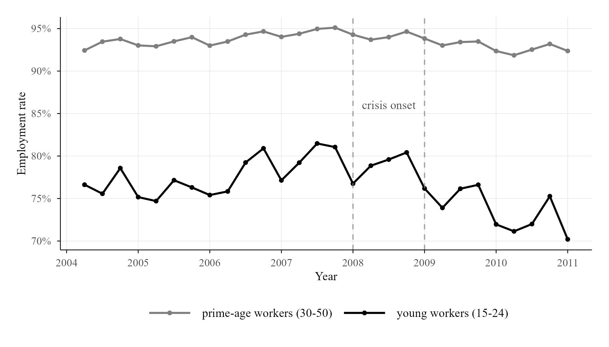

# The Impact of the 2008 Financial Crisis on Youth Employment in Italy

This project analyzes the causal effect of the 2008 Global Financial Crisis on youth employment in Italy using a **Difference-in-Differences (DID)** framework. It compares employment outcomes of young workers (age 15–24) against prime-age workers (age 30–50) before (2006–2007) and after (2009–2010) the crisis, finding a **3.8 percentage point greater reduction** in employment probability for young workers.

**Data Source:**  
- [European Union Labour Force Survey (EU-LFS) microdata, 2004–2010](https://ec.europa.eu/eurostat/web/microdata/european-union-labour-force-survey)
- Publicly available from Eurostat

**Methodology:**  
1. **Sample Construction:** Restricted to young (15–24) and prime-age (30–50) workers, excluding 2008 as a transition year  
2. **Main Model:** Difference-in-Differences regression  
   \[
   Y_{it} = \beta_0 + \beta_1\text{Treat}_i + \beta_2\text{Post}_t + \beta_3(\text{Treat}_i\times \text{Post}_t) + \mathbf{X}_{it}\gamma + \epsilon_{it}
   \]
3. **Robustness Checks:**  
   - Added demographic controls (sex, age)  
   - Event study to validate parallel trends  
   - Placebo test (pretend crisis in 2006)  
   - Triple difference by gender  
   - Alternative outcomes: hours worked, part-time employment  

## Results

| Finding | Magnitude | Statistical Significance |
|---------|-----------|--------------------------|
| Employment probability reduction for youth vs. prime-age | -3.8 percentage points | p < 0.01 |
| Reduction in weekly hours (employed youth) | -0.5 hours | p < 0.001 |
| Increase in part-time employment among youth | +3.6 percentage points | p < 0.001 |
| Gender heterogeneity (young women vs. young men) | Not significant | p > 0.1 |

### Parallel employment Trends by Age Group (2004–2010)

### Event Study Estimates (Relative to 2008)

